# cmapss-rul — Confronto di modelli di regressione per la previsione della vita utile residua

**Autore:** Luca Bellu ([LucaBelluu](https://github.com/LucaBelluu))
**Progetto sperimentale di Machine Learning, A.A. 2025/2026**
**Dataset:** NASA C-MAPSS (Turbofan Engine Degradation Simulation), NASA Prognostics Data Repository

## Panoramica

Il progetto confronta ventidue modelli di regressione sulla previsione della vita utile residua di motori turbofan, cioè del numero di cicli di funzionamento che mancano al guasto, a partire dalle letture dei sensori di bordo. I modelli coprono per intero il repertorio di regressione del programma del corso, dai minimi quadrati alle macchine a vettori di supporto e alle reti neurali multistrato, e sono valutati sotto un protocollo unico, sugli stessi dati, sulle stesse partizioni e con la stessa metrica.

Il confronto è replicato su due sottoinsiemi del dataset, FD001 e FD003, che differiscono per il solo numero di modi di guasto (uno contro due). La replica separa una conclusione sui modelli da una conclusione su un singolo dataset.

Il risultato è una struttura a tre gradini che si ripete identica sulle due popolazioni e in tutte le letture. I modelli lineari si fermano attorno ai venti cicli di errore e non si distinguono fra loro: dai minimi quadrati alla ricerca esaustiva su 262.143 sottoinsiemi di variabili l'ampiezza interna alla famiglia vale 0,03 cicli su FD001 e 0,09 su FD003, contro una dispersione fra fold sopra l'unità. I modelli che rappresentano una funzione liscia per variabile guadagnano circa tre cicli. Gli insiemi di alberi, la macchina a vettori di supporto con kernel radiale e la rete neurale occupano il gradino superiore e vi convergono da principi costruttivi diversi, il che indica che il limite residuo dipende dal problema e dalla rappresentazione dei dati più che dalla classe di modelli.

Il vertice della graduatoria si comporta diversamente sui due sottoinsiemi. Su FD003 la rete neurale è prima in cross-validation e in tutte e tre le letture dell'insieme di verifica indipendente, con un vantaggio venti volte maggiore della variabilità dovuta al seme di inizializzazione. Su FD001 la rete precede la foresta casuale di 0,014 cicli, cioè di un terzo del rumore della propria inizializzazione, perde il primo posto in due letture della verifica su tre ed è la peggiore delle due su undici partizioni su quindici: su quel sottoinsieme il primo posto non è assegnabile, e non viene assegnato.

Il contributo del progetto sta nel disegno sperimentale, nel protocollo di valutazione e nella sua convalida, nella riformulazione algebrica che rende eseguibile la ricerca esaustiva sui sottoinsiemi di variabili, nelle letture diagnostiche che esaminano il vertice della graduatoria e nell'analisi dei risultati. Le implementazioni dei modelli provengono da librerie di terzi, elencate in fondo.

## Ambiente e installazione

Il progetto è sviluppato su macOS con Python 3.12 in un ambiente conda dedicato. conda gestisce l'interprete e le dipendenze native, pip le librerie Python. `requirements.txt` fissa le versioni esatte con cui gli esperimenti sono stati eseguiti.

```bash
conda create -n cmapss-rul python=3.12
conda activate cmapss-rul
pip install -r requirements.txt
```

Su macOS serve un passaggio aggiuntivo. XGBoost non è puro Python: la parte computazionale è una libreria nativa che richiede il runtime OpenMP, assente dalla distribuzione su PyPI perché è una dipendenza di sistema fuori dalla portata di pip. Senza di esso l'importazione di `xgboost` fallisce.

```bash
conda install -c conda-forge llvm-openmp
```

Il manifesto delle librerie Python non descrive quindi da solo l'ambiente completo, ed è un limite dichiarato della riproduzione. Per eseguire i notebook con l'interprete del progetto conviene registrare l'ambiente come kernel:

```bash
python -m ipykernel install --user --name cmapss-rul
```

### Acquisizione dei dati

I dati non sono versionati. L'archivio va scaricato dal NASA Prognostics Data Repository e i file estratti collocati in `data/raw/`, senza cartelle intermedie e senza modifiche:

```
https://phm-datasets.s3.amazonaws.com/NASA/6.+Turbofan+Engine+Degradation+Simulation+Data+Set.zip
```

`data/raw/` deve contenere i dodici file `train_FD00X.txt`, `test_FD00X.txt` e `RUL_FD00X.txt`. L'acquisizione è manuale: uno script dedicato è stato valutato e scartato perché sarebbe rimasto nella repository senza essere mai eseguito, e uno script non testato dà l'apparenza di una procedura riproducibile senza esserlo.

Il primo comando verifica che i file siano quelli attesi, controllando numero di righe e di unità contro valori cablati nel codice, assenza di valori mancanti, contiguità degli identificativi e consecutività dei numeri di ciclo entro ogni unità. Quest'ultimo controllo è il più importante: con cicli mancanti la vita residua costruita per differenza sarebbe errata senza che nulla lo segnali.

```bash
python -m scripts.verify_raw_data
```

### Esecuzione degli esperimenti

Gli script si invocano come moduli e non per percorso, perché l'invocazione per percorso colloca `scripts/` in cima al percorso di ricerca di Python anziché la radice e l'import di `src` fallisce. Tutti accettano `--subsets` e usano per impostazione predefinita i due sottoinsiemi in perimetro. Semi e soglia di censura sono valori predefiniti fissati nel protocollo e non vanno passati per riprodurre i risultati riportati.

```bash
# Esplorazione e convalida del protocollo
python -m scripts.run_exploration
python -m scripts.run_protocol_check
python -m scripts.run_selection_check
python -m scripts.run_resampling

# I quattro blocchi del confronto
python -m scripts.run_linear_models
python -m scripts.run_nonlinear_models
python -m scripts.measure_tree_costs
python -m scripts.run_tree_models
python -m scripts.measure_kernel_costs
python -m scripts.run_kernel_models

# Chiusura
python -m scripts.run_final_ranking
python -m scripts.run_seed_diagnostic
python -m scripts.run_holdout
python -m scripts.run_censoring_sensitivity
python -m scripts.run_clustering
```

L'ordine è vincolante: `run_final_ranking` compone le tabelle dei quattro blocchi dopo aver verificato che siano state prodotte sulle stesse partizioni, e `run_seed_diagnostic` e `run_holdout` ricostruiscono i modelli selezionati dagli artefatti dei blocchi.

I costi non sono omogenei. `run_kernel_models` è il più oneroso dell'intero progetto, seguito da `measure_kernel_costs`; `run_tree_models`, `run_seed_diagnostic`, `run_holdout` e `run_censoring_sensitivity` sono intermedi; gli altri sono rapidi. La graduatoria è ricavata dai tempi di ricerca registrati negli artefatti di diagnostica di ciascun blocco ed è relativa: i valori assoluti dipendono dalla macchina e non sono riportati.

Le esecuzioni parziali di `run_holdout` non scrivono su disco, per impedire la sovrascrittura di una tabella completa con un sottoinsieme di righe.

### Analisi

I notebook leggono gli artefatti e non eseguono lavoro computazionale, quindi si eseguono dall'inizio alla fine in pochi secondi ciascuno. Rigenerano figure e tabelle in `results/`, che sono comunque già versionate e consultabili senza eseguire nulla.

```bash
jupyter nbconvert --to notebook --execute --inplace notebooks/01_esplorazione.ipynb
jupyter nbconvert --to notebook --execute --inplace notebooks/02_modelli_lineari.ipynb
jupyter nbconvert --to notebook --execute --inplace notebooks/03_modelli_non_lineari.ipynb
jupyter nbconvert --to notebook --execute --inplace notebooks/04_modelli_ad_albero.ipynb
jupyter nbconvert --to notebook --execute --inplace notebooks/05_metodi_a_margine_e_reti.ipynb
jupyter nbconvert --to notebook --execute --inplace notebooks/06_confronto_complessivo.ipynb
```

## Struttura della repository

```
cmapss-rul/
├── src/                    codice riutilizzabile e parametrico
│   ├── data.py             lettura dei file grezzi, unico accesso a data/raw/
│   ├── target.py           costruzione della vita utile residua e censura a soglia
│   ├── explore.py          statistiche descrittive dei quattro sottoinsiemi
│   ├── design.py           matrice di progetto e tre letture dell'insieme di verifica
│   ├── protocol.py         partizionamento, fold, semi, metriche, valutazione
│   ├── pipeline.py         composizione di selezione colonne, scalatura e modello
│   ├── baselines.py        predizione costante e regressione sul solo numero di ciclo
│   ├── registry.py         stimatori, griglie e lettura dei parametri di ogni modello
│   ├── search.py           ricerca su griglia, controllo dei bordi, diagnostica
│   ├── experiment.py       motore a due stadi, tabelle di confronto, divario
│   ├── selection.py        motore di stima dedicato e tre metodi di selezione
│   ├── resampling.py       procedure di stima dell'errore del laboratorio 6
│   ├── nonlinear.py        espansioni di base e adattatore del modello additivo
│   ├── trees.py            letture strutturali della famiglia ad albero
│   ├── margin.py           letture strutturali dei metodi a margine e delle reti
│   ├── selected.py         ricostruzione dei modelli selezionati dagli artefatti
│   ├── final.py            composizione dei blocchi, verifica partizioni, appaiamento
│   └── clustering.py       variabili per motore, punteggi ed etichette di gruppo
├── scripts/                orchestrazione: compone gli esperimenti invocando src/
├── notebooks/              analisi: leggono artefatti e non eseguono calcolo
├── data/                   dati grezzi (non versionati)
├── experiments/            artefatti numerici per esperimento (non versionati)
├── results/
│   ├── figures/            51 figure finali esportate dai notebook
│   └── tables/             50 tabelle finali esportate dai notebook
├── requirements.txt
├── DIARIO.md               registro cronologico delle decisioni e delle motivazioni
└── README.md
```

L'organizzazione segue due principi. Il primo separa l'esecuzione di una singola operazione, che sta in `src/` ed è parametrica, dalla composizione delle operazioni in un esperimento, che sta in `scripts/`: un esperimento è così descritto dai comandi che lo compongono e riproducibile leggendoli. Alla stessa logica risponde la separazione fra registro dei modelli e motore di esperimento: ogni blocco aggiunge il proprio registro senza toccare il motore, quindi nessun modello può ricevere un trattamento diverso dagli altri per effetto di codice duplicato che diverge.

Il secondo separa l'esecuzione dalla narrazione. Il lavoro computazionale sta negli script, i notebook leggono i risultati salvati e li analizzano, il che elimina alla radice stato nascosto, esecuzione fuori ordine e irriproducibilità.

Restano fuori dal versionamento i dati grezzi, gli artefatti degli esperimenti, i modelli serializzati e le cache, tutti pesanti e rigenerabili. Sono versionate le tabelle e le figure finali, leggere e consultabili senza eseguire il codice, che costituiscono la prova tracciabile dei risultati. `DIARIO.md` registra il percorso decisionale, le alternative scartate e i problemi tecnici incontrati; questo documento descrive il progetto finito.

## Dati e definizione del problema

### Il dataset

C-MAPSS raccoglie traiettorie di degrado di motori turbofan simulati, osservati dall'inizio del monitoraggio fino al guasto. Ogni riga è un ciclo di funzionamento e contiene identificativo del motore, numero di ciclo, tre impostazioni operative che descrivono la condizione di volo e ventuno letture di sensori. Ogni motore produce una sequenza di righe di lunghezza pari alla propria durata di vita.

Il dataset è diviso in quattro sottoinsiemi per numero di condizioni operative e di modi di guasto. Ciascuno è distribuito in tre file: traiettorie di addestramento, che arrivano al guasto; traiettorie di verifica, troncate in un punto casuale prima del guasto; e un file di etichette che riporta, per ogni motore di verifica, i cicli mancanti al guasto all'ultimo ciclo osservato.

| Sottoinsieme | Motori | Righe | Durata min | Durata mediana | Durata max | Dispersione | Regimi | Costanti | max abs Pearson |
|---|---|---|---|---|---|---|---|---|---|
| FD001 | 100 | 20.631 | 128 | 199,0 | 362 | 46,3 | 1 | 7 | 0,70 |
| FD002 | 260 | 53.759 | 128 | 199,0 | 378 | 46,8 | 6 | 0 | 0,07 |
| FD003 | 100 | 24.720 | 145 | 220,5 | 525 | 86,5 | 1 | 6 | 0,69 |
| FD004 | 249 | 61.249 | 128 | 234,0 | 543 | 73,1 | 6 | 0 | 0,08 |

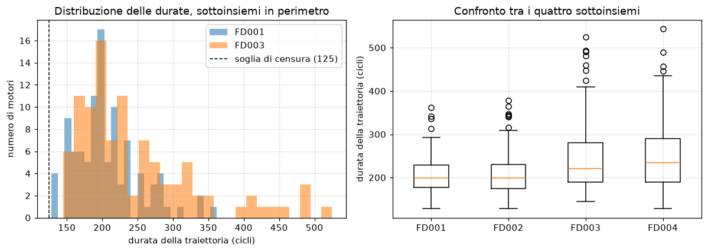

Il conteggio delle unità di FD004 è ricavato dai file e non dalla documentazione che li accompagna, che attribuisce a quel sottoinsieme 248 traiettorie di addestramento e 249 di verifica mentre i file contengono l'opposto. La fonte primaria adottata è il dato.

### Costruzione del target

La vita utile residua non è una colonna del dataset. Sulle traiettorie di addestramento è la differenza fra il ciclo del guasto e il ciclo corrente; su quelle di verifica, troncate, si ricava dall'etichetta del motore sommando i cicli che mancano alla fine della traiettoria osservata. Le due strade sono implementate separatamente, e la loro coerenza è verificata da un controllo che fa fallire il caricamento: il target ricostruito dalle etichette deve coincidere, sull'ultimo ciclo di ogni unità, con l'etichetta censurata. Un disallineamento posizionale fra etichette e motori produrrebbe altrimenti un target quasi costante e facile da prevedere, cioè un risultato migliore del vero senza alcun segnale d'errore.

### Censura del target

Al target è applicata una censura a soglia: le vite residue superiori a 125 cicli sono portate a 125.

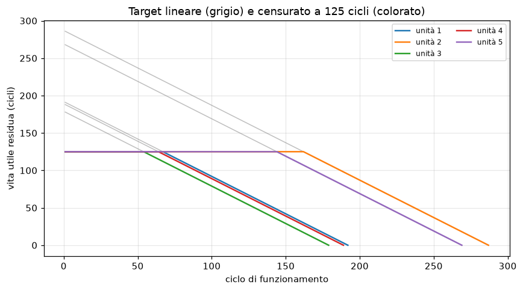

La motivazione è fisica prima che statistica. Nella prima parte della vita di un motore il degrado non è osservabile dai sensori, e letture di unità con vite residue molto diverse sono in quella fase indistinguibili: un target lineare richiede allora di prevedere valori diversi da ingressi uguali, e questa componente irriducibile pesa in modo sproporzionato in una metrica quadratica perché ricade sui valori più grandi.

L'assunzione è stata verificata calcolando la correlazione fra ciascun sensore e la vita residua separatamente sopra e sotto la soglia. Su FD001 la separazione è netta (per i cinque sensori più informativi la correlazione passa da circa 0,15 sopra soglia a circa 0,75 sotto) e l'assunzione regge. Su FD003 esiste ma è meno pronunciata, con correlazioni che sopra soglia raggiungono 0,42: una parte di informazione utile è presente già prima della soglia e la censura la scarta.

La soglia di 125 cicli è inferiore alla traiettoria più breve di entrambi i sottoinsiemi, quindi ogni motore attraversa sia la fase censurata sia la fase di degrado e nessuna traiettoria risulta interamente costante. La soglia non è stata modificata dopo la verifica, perché era fissata a priori e cambiarla dopo averne visto l'effetto sarebbe stata una scelta condizionata dal risultato; non è inoltre trattata come iperparametro, perché abbassandola l'errore quadratico medio cala per costruzione e un confronto fra soglie basato sull'errore selezionerebbe sempre la più bassa.

Limite dichiarato: la soglia è un'ipotesi di modellazione e non una quantità misurata, i valori assoluti di tutte le metriche dipendono da essa, e su FD003 scarta una parte di segnale. La dipendenza della conclusione dalla soglia è misurata nella sezione sui controlli.

### Perimetro sperimentale

Gli esperimenti usano FD001 e FD003, che tengono fermo il regime di volo e fanno variare il solo numero di modi di guasto: il pre-processing resta identico, il protocollo è letteralmente lo stesso, e le due popolazioni sono effettivamente diverse, con FD003 che ha traiettorie più lunghe e quasi doppia dispersione delle durate.

FD002 e FD004 sono esclusi su base misurata. Su di essi nessuna variabile risulta costante, ma non per maggiore informatività: rapportando la deviazione standard misurata entro un singolo regime a quella complessiva, su FD002 il rapporto non supera 0,18 per alcun sensore e per la maggior parte resta sotto 0,06. Fissata la condizione di volo la variabilità delle letture quasi scompare, e quella osservata accorpando i sei regimi è dovuta al regime e non al degrado; è la ragione per cui su quei sottoinsiemi la correlazione marginale con il target si annulla. Renderli utilizzabili richiederebbe uno stadio di normalizzazione dei sensori entro regime, che sposterebbe il baricentro del lavoro dalla comparazione fra modelli alla progettazione del pre-processing.

Limite dichiarato: il lavoro non copre il caso a condizioni operative multiple, e le conclusioni valgono per il regime singolo.

### Rappresentazione delle osservazioni

Una riga per ciclo, letture grezze, nessuna aggregazione su finestre temporali. L'alternativa naturale sarebbe aggiungere statistiche su finestra mobile, che su questi dati produce il guadagno maggiore ed è la ragione per cui i valori assoluti riportati restano distanti da quelli ottenibili in letteratura sullo stesso dataset. È però ingegnerizzazione di variabili su serie temporali, fuori dal materiale del corso; introduce l'ampiezza della finestra come iperparametro da selezionare, moltiplicando il costo di ogni griglia; richiede che la finestra sia strettamente causale, con rischio di fuga di informazione nei primi cicli di ogni traiettoria; e sposterebbe il baricentro del lavoro dalla comparazione fra modelli alla progettazione delle variabili.

Le colonne costanti sono rimosse con criterio basato sul numero di valori distinti e non sulla deviazione standard: su una colonna di valori identici la deviazione standard calcolata numericamente non è esattamente nulla ma un residuo di arrotondamento, e il confronto con zero lascia passare colonne prive di informazione. Il criterio è applicato alle sole traiettorie di addestramento, è identico sui due sottoinsiemi e produce liste diverse, perché `sensor_10` è costante su FD001 e assume quattro valori su FD003. La costanza è una proprietà strutturale del sensore in quel regime e non dipende dal target, quindi determinarla sull'intera parte di addestramento non introduce informazione proveniente dalle partizioni di verifica. Restano 18 variabili su FD001 e 19 su FD003. `setting_1` e `setting_2` sono mantenute pur non portando informazione, perché il loro contributo nullo è materiale per il commento dei modelli con selezione delle variabili.

Il numero di ciclo è incluso fra le esplicative: il conteggio dei cicli percorsi è noto al momento della previsione anche su una traiettoria troncata. Va però considerato che sulle traiettorie complete la vita residua è per costruzione la differenza fra durata e ciclo corrente, mentre su quelle troncate il punto di interruzione è casuale, quindi la relazione non si trasferisce integralmente dall'addestramento alla verifica.

Una previsione formulata in fase di esplorazione è stata smentita e ha conseguenze metodologiche. L'attesa era che i sensori più correlati con il target fossero fortemente correlati tra loro e che la dimensionalità effettiva fosse molto minore di 21; la misura mostra invece che su FD001 una sola coppia su 105 supera 0,9 in valore assoluto. Su questi dati la giustificazione della regolarizzazione e della regressione sulle componenti principali non può quindi poggiare sulla ridondanza fra variabili esplicative, ma sul rapporto fra numero di variabili e numero di unità indipendenti: le righe sono decine di migliaia, i motori sono cento, e la numerosità campionaria rilevante è la seconda.

## Protocollo di valutazione

Il protocollo è stato definito, implementato e convalidato prima dell'addestramento di qualsiasi modello del confronto. È scritto in un unico modulo (`src/protocol.py`) attraverso cui passa ogni esperimento; le funzioni accettano qualunque oggetto con `fit` e `predict`, quindi la parità del confronto è garantita dal codice e non dalla disciplina di chi lo usa.

### Partizionamento per unità

Le righe dello stesso motore descrivono la stessa traiettoria a cicli consecutivi e sono fortemente correlate. Una partizione casuale per riga collocherebbe cicli adiacenti dello stesso motore in partizioni diverse, valutando il modello su osservazioni quasi identiche a quelle di addestramento. La partizione avviene quindi per unità motore, e l'entità dell'effetto è stata misurata a parità di modello, numero di fold e seme.

| Sottoinsieme | Modello | Per riga | Per unità | Ottimismo | Relativo |
|---|---|---|---|---|---|
| FD001 | Regressione lineare | 19,98 | 20,33 | 0,35 | 1,7 % |
| FD001 | Foresta casuale | 15,89 | 16,73 | 0,85 | 5,1 % |
| FD003 | Regressione lineare | 19,27 | 20,05 | 0,79 | 3,9 % |
| FD003 | Foresta casuale | 13,10 | 15,26 | 2,17 | 14,2 % |

L'effetto è sistematico e cresce con la capacità del modello di memorizzare le righe vicine e con la lunghezza delle traiettorie. È però più contenuto di quanto la motivazione qualitativa lasciasse prevedere: su FD001 un partizionamento per riga sottostimerebbe l'errore di poco più del cinque per cento anche su un modello a capacità alta. La misura mostra che il vincolo di gruppo sposta i margini del confronto, non che senza di esso i risultati sarebbero privi di significato. I due modelli impiegati non sono ottimizzati e non appartengono al confronto, e sotto partizione per riga anche la selezione degli iperparametri deriverebbe, aggiungendo un ottimismo che questa misura non cattura.

Lo schema di cross-validation con vincolo di gruppo non compare nei laboratori del corso: è la trasposizione diretta del K-Fold a dati raggruppati, resa obbligatoria dalla struttura del dataset.

### Numero di fold

Cinque fold con vincolo di gruppo, ripetuti su tre semi di partizionamento, per quindici valutazioni per modello. Con cento motori per sottoinsieme, cinque fold lasciano venti motori e circa quattromila righe per parte di verifica; dieci fold porterebbero la verifica a dieci motori, rendendo instabile la stima del singolo fold, e l'esclusione di un motore per volta richiederebbe cento addestramenti per configurazione.

Le quattro procedure di stima dell'errore del programma sono state applicate alla regressione lineare multipla, ricampionando i motori e non le righe.

| Procedura | FD001 | FD003 | Stime |
|---|---|---|---|
| Partizione unica, 20 semi | 20,29 ± 1,50 | 19,56 ± 1,13 | 20 |
| Esclusione di un motore per volta | 19,30 ± 6,52 | 19,57 ± 6,33 | 100 |
| K-Fold a 5 | 20,35 ± 1,18 | 19,93 ± 1,46 | 15 |
| K-Fold a 10 | 20,19 ± 2,43 | 19,74 ± 2,52 | 30 |
| Bootstrap sui motori | 20,37 ± 1,05 | 20,00 ± 0,93 | 200 |

Le medie si ordinano secondo la numerosità della parte di addestramento, che è il compromesso fra distorsione e varianza delle procedure di ricampionamento misurato sui dati del progetto. Le dispersioni non misurano la stessa quantità e non sono intercambiabili: per la partizione unica descrivono la variabilità fra partizioni, per il K-Fold la variabilità fra parti di verifica, per il bootstrap la variabilità fra campioni; quella dell'esclusione di un motore per volta è la più ampia perché ogni stima è calcolata su una singola traiettoria e misura quanto i motori differiscono fra loro. Il K-Fold a 10 ha dispersione doppia rispetto a quello a 5 con media quasi identica, ed è la giustificazione empirica del numero di fold adottato.

Il risultato più rilevante riguarda la partizione unica: ripetuta su venti semi produce su FD001 stime da 17,28 a 23,05 cicli per lo stesso modello sugli stessi dati, con la sola differenza di quali motori finiscono da che parte. Il divario che separa tutti i modelli del blocco lineare vale 0,03 cicli, due ordini di grandezza sotto quell'escursione: valutare con una partizione unica avrebbe reso il confronto indistinguibile dal rumore di partizionamento.

### Selezione degli iperparametri

La conduzione è in due stadi. La ricerca esaustiva su griglia opera sulle cinque partizioni del seme 0; la configurazione selezionata è poi rivalutata sulle quindici partizioni dei tre semi, e i quindici punteggi producono media e dispersione riportate nelle tabelle. Lo sdoppiamento evita che la ripetizione dentro la ricerca triplichi il costo di ogni griglia, che sulle macchine a vettori di supporto è la differenza fra un esperimento eseguibile e uno che non lo è.

La cross-validation non è annidata: le stesse partizioni servono a scegliere gli iperparametri e a riportare il punteggio della configurazione scelta, come nei laboratori del corso, e il punteggio riportato è quindi ottimisticamente distorto. La scelta è ammissibile perché esiste un insieme di verifica esterno che non partecipa ad alcuna selezione. L'alternativa annidata è stata scartata anche per una ragione non di costo: produce iperparametri diversi in ciascun fold esterno, quindi non identifica un modello selezionato di cui leggere coefficienti, importanze e struttura, cioè il materiale con cui si costruisce il commento di ciascun modello.

Una regola sulle configurazioni di bordo è fissata prima delle esecuzioni e verificata dal codice: se la configurazione selezionata cade su un estremo della griglia, la griglia viene estesa da quel lato e la ricerca rieseguita. Le estensioni sono applicate a entrambi i sottoinsiemi anche quando il bordo si manifesta su uno solo, perché griglie diverse renderebbero le due repliche non più condotte sotto lo stesso protocollo, e i valori di partenza restano in griglia anche quando peggiori, perché rimuoverli sarebbe una selezione a posteriori sulla griglia. La regola distingue il bordo vero, oltre il quale esiste un modello diverso e più flessibile, dal bordo strutturale, oltre il quale si trova un modello già presente nel confronto oppure una stima che non converge; nel secondo caso l'estensione non viene eseguita. La distinzione è dichiarata prima di ogni esecuzione e non dipende dai punteggi ottenuti.

### Metrica e regola di lettura

La metrica di selezione e di ordinamento è la radice dell'errore quadratico medio: è nelle unità del target, quindi interpretabile in cicli, ed è coerente con la perdita minimizzata dalla maggior parte dei modelli in confronto. Errore assoluto medio e coefficiente di determinazione sono riportati a corredo e mai usati per selezionare. Le metriche sono calcolate per fold e poi mediate, perché aggregare le previsioni di tutti i fold in un unico vettore produrrebbe un numero solo e perderebbe la dispersione, che è parte del risultato. La funzione di punteggio asimmetrica adottata in letteratura su C-MAPSS è stata scartata perché fuori dal materiale del corso e perché l'asimmetria è un'assunzione di dominio che il lavoro non è in grado di giustificare.

La regola di lettura che governa l'intero documento è la seguente: **due modelli il cui divario è inferiore alla dispersione combinata delle due righe si considerano non distinguibili sotto questo protocollo e non vengono ordinati.** La dispersione riportata è calcolata sui fold e non è un errore standard, perché i fold condividono le righe di addestramento e non sono indipendenti; non consente quindi test di significatività. La colonna del divario espressa in dispersioni è una distanza e non un ordine, e fra righe di dispersione molto diversa può invertire l'ordinamento dell'errore: su FD001 la baseline sul solo numero di ciclo ha errore 27,88 e divario 5,64 mentre il kernel polinomiale ha errore 23,35 e divario 5,72. L'ordinamento è sempre quello della colonna dell'errore.

### Baseline e insieme di verifica

Ogni tabella è preceduta da due baseline. La predizione costante pari alla media del target di addestramento è il pavimento assoluto, e la sua radice dell'errore quadratico medio riproduce la deviazione standard del target (41,69 contro 41,67 su FD001), il che è anche un controllo di coerenza fra target e metrica. La regressione sul solo numero di ciclo è il pavimento informativo, e il guadagno di ciascun modello si legge rispetto a essa. Le due baseline sono ricalcolate dentro ogni blocco del confronto.

I file di verifica ufficiali costituiscono l'insieme finale. Non entrano in alcuna scelta e sono letti a graduatoria chiusa, su ciascun modello già selezionato e riaddestrato sull'intera parte di addestramento. Poiché ogni motore di verifica ha una sola etichetta ma una traiettoria di molte righe, sono adottate tre letture: su tutti i cicli, sul solo ultimo ciclo di ciascuna unità (la forma con cui il dataset è riportato in letteratura) e sull'ultimo ciclo contro target non censurato. Va dichiarato che l'insieme di verifica non è rimasto letteralmente intatto: in fase di convalida del protocollo è stato letto per le due baseline e per la regressione lineare multipla, modelli deterministici e senza iperparametri, e quella lettura è poi servita come controllo di fedeltà della catena dati.

### Pre-processing

Selezione delle colonne, standardizzazione e modello sono composti in una pipeline unica, quindi la standardizzazione è adattata dentro ciascun fold sulla sola parte di addestramento. È applicata a tutti i modelli, anche a quelli per cui è irrilevante, perché un pre-processing differenziato per famiglia introdurrebbe una differenza di condizioni fra modelli confrontati. Lo stimatore è clonato prima di ogni addestramento: senza clonazione un oggetto già adattato può conservare stato, il che non fa fallire nulla e produce numeri leggermente errati.

## Risultati del confronto

### Graduatoria complessiva

Radice dell'errore quadratico medio in cross-validation, media e dispersione sulle quindici partizioni. Le due colonne sono repliche indipendenti dello stesso protocollo su popolazioni diverse e non vanno confrontate in valore assoluto.

| Modello | Blocco | FD001 | Rango | FD003 | Rango |
|---|---|---|---|---|---|
| Percettrone multistrato | Margine e reti | 16,58 ± 1,40 | 1 | 14,04 ± 1,06 | 1 |
| Foresta casuale | Albero | 16,59 ± 1,46 | 2 | 14,70 ± 1,21 | 5 |
| XGBoost | Albero | 16,70 ± 1,36 | 3 | 14,56 ± 1,11 | 2 |
| Gradient boosting | Albero | 16,71 ± 1,37 | 4 | 14,58 ± 1,14 | 3 |
| Bagging di alberi | Albero | 16,89 ± 1,44 | 5 | 14,94 ± 1,11 | 6 |
| SVR, kernel radiale | Margine e reti | 16,96 ± 1,41 | 6 | 14,68 ± 1,37 | 4 |
| AdaBoost | Albero | 16,97 ± 1,27 | 7 | 15,52 ± 1,18 | 7 |
| Modello additivo generalizzato | Non lineare | 17,46 ± 1,21 | 8 | 15,95 ± 1,09 | 9 |
| Regression spline | Non lineare | 17,47 ± 1,19 | 9 | 15,91 ± 1,10 | 8 |
| Step functions | Non lineare | 17,69 ± 1,20 | 10 | 16,10 ± 1,08 | 10 |
| Regressione polinomiale | Non lineare | 17,75 ± 1,28 | 11 | 16,44 ± 1,02 | 11 |
| Albero di regressione potato | Albero | 18,48 ± 1,27 | 12 | 16,87 ± 1,13 | 12 |
| SVR, kernel lineare | Margine e reti | 20,32 ± 1,12 | 13 | 19,83 ± 1,52 | 13 |
| Ridge | Lineare | 20,33 ± 1,14 | 14 | 19,88 ± 1,45 | 17 |
| Elastic Net | Lineare | 20,33 ± 1,13 | 15 | 19,89 ± 1,45 | 18 |
| Best subset, forward, backward | Lineare | 20,34 ± 1,18 | 16-18 | 19,85 ± 1,45 | 14-16 |
| Lasso | Lineare | 20,35 ± 1,18 | 19 | 19,92 ± 1,46 | 19 |
| Regressione lineare multipla | Lineare | 20,35 ± 1,18 | 20 | 19,93 ± 1,46 | 20 |
| Componenti principali | Lineare | 20,35 ± 1,17 | 21 | 19,93 ± 1,46 | 21 |
| SVR, kernel polinomiale | Margine e reti | 23,35 ± 0,93 | 22 | 26,34 ± 2,67 | 22 |
| *Baseline sul solo numero di ciclo* | | 27,88 ± 2,47 | 23 | 35,12 ± 2,64 | 23 |
| *Predizione costante* | | 41,69 ± 0,14 | 24 | 40,73 ± 0,65 | 24 |

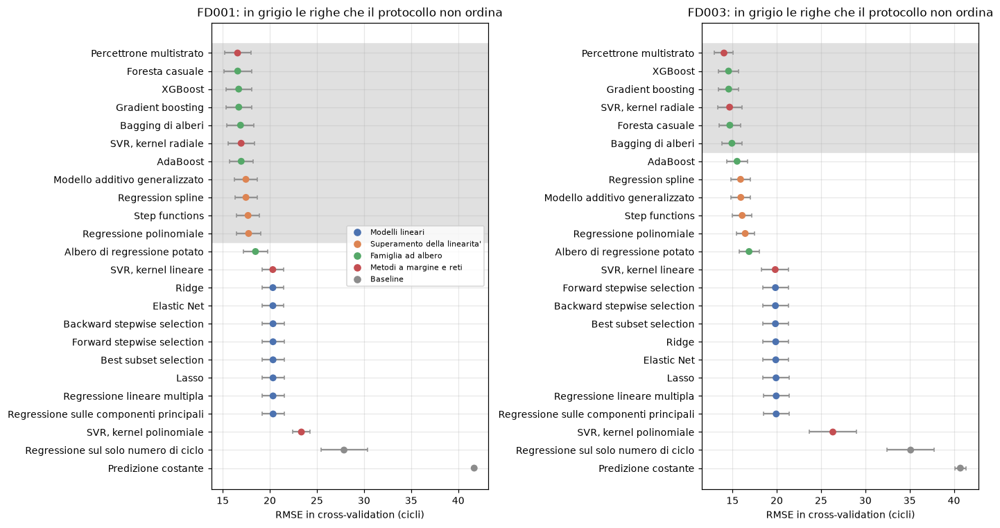

I tre metodi di selezione occupano una riga sola perché selezionano lo stesso sottoinsieme e producono lo stesso errore; negli artefatti hanno righe separate e ranghi distinti, ma quei ranghi sono determinati da differenze che compaiono alla quattordicesima cifra decimale.

La composizione della graduatoria a partire da quattro esecuzioni distinte presuppone che i punteggi siano stati calcolati sulle stesse partizioni. Il presupposto è verificabile perché le due baseline sono ricalcolate in ogni blocco, e la verifica confronta conteggi di righe e di motori di ciascun fold oltre ai punteggi: sedici confronti per sottoinsieme, tutti a scarto nullo con conteggi identici. La verifica precede la graduatoria e la blocca in caso di scostamento.

### Copertura del programma

| Modello | Laboratorio |
|---|---|
| Regressione lineare semplice e multipla | 3 |
| Ridge, Lasso, Elastic Net, componenti principali | 7 |
| Best subset, forward stepwise, backward stepwise | 7 |
| Regressione polinomiale, step functions, regression spline, modello additivo generalizzato | 8 |
| Albero di regressione potato, bagging | 9 |
| Foresta casuale, AdaBoost, gradient boosting, XGBoost | 10 |
| SVR con kernel lineare, radiale, polinomiale; percettrone multistrato | 11 |

Il K-nearest neighbours in versione regressiva non è nel confronto. Nei laboratori compare una sola volta, come una delle alternative suggerite per un esercizio di classificazione dopo riduzione con PCA, e non in forma regressiva.

### Struttura per famiglie

| Sottoinsieme | Blocco | Modelli | Errore minimo | Errore massimo | Ampiezza interna | Dispersione mediana |
|---|---|---|---|---|---|---|
| FD001 | Lineare | 8 | 20,33 | 20,35 | 0,03 | 1,18 |
| FD001 | Non lineare | 4 | 17,46 | 17,75 | 0,29 | 1,21 |
| FD001 | Albero | 6 | 16,59 | 18,48 | 1,89 | 1,36 |
| FD001 | Margine e reti | 4 | 16,58 | 23,35 | 6,77 | 1,26 |
| FD003 | Lineare | 8 | 19,85 | 19,93 | 0,09 | 1,45 |
| FD003 | Non lineare | 4 | 15,91 | 16,44 | 0,53 | 1,09 |
| FD003 | Albero | 6 | 14,56 | 16,87 | 2,31 | 1,13 |
| FD003 | Margine e reti | 4 | 14,04 | 26,34 | 12,29 | 1,44 |

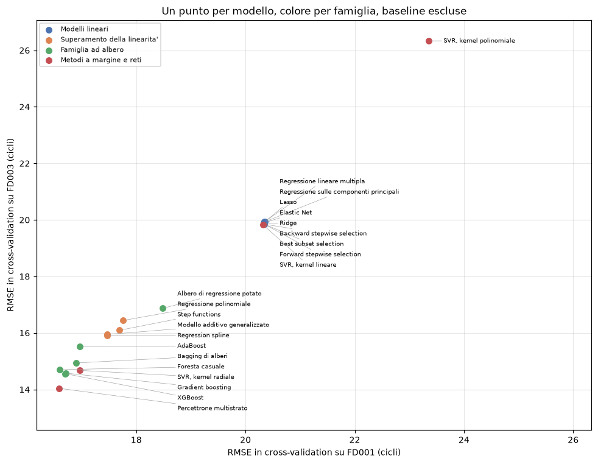

L'ampiezza interna alla famiglia lineare è due ordini di grandezza sotto la dispersione mediana: otto modelli diversi producono lo stesso numero. La famiglia a margine ha invece l'ampiezza interna maggiore, perché contiene sia il modello migliore del confronto sia il peggiore, e la scelta del kernel vi conta più della scelta della famiglia.

Il divario fra famiglia lineare e famiglia additiva è ampio su entrambi i sottoinsiemi e supera largamente la dispersione fra fold. Quello fra famiglia additiva e gradino di testa è più stretto: resta leggibile su FD003 e non lo è su FD001, dove il gruppo che il protocollo non ordina si allarga fino a comprendere i modelli additivi e restano separati soltanto l'albero singolo, la famiglia lineare e il kernel polinomiale. Il risultato difendibile è quindi che **l'ordine dei tre gradini si replica sui due sottoinsiemi, mentre la risoluzione con cui il protocollo li separa cambia da un sottoinsieme all'altro.**

Cautela che vale per l'intera tabella: i punteggi sono ottimisticamente distorti perché la cross-validation non è annidata, e la distorsione non è uniforme fra le righe, dato che il numero di configurazioni valutate sulle stesse partizioni su cui il punteggio è poi riportato varia da 1 (bagging, privo di griglia) a 524.287 (ricerca esaustiva su FD003).

## Commento dei modelli

### Modelli lineari, regolarizzazione e selezione delle variabili

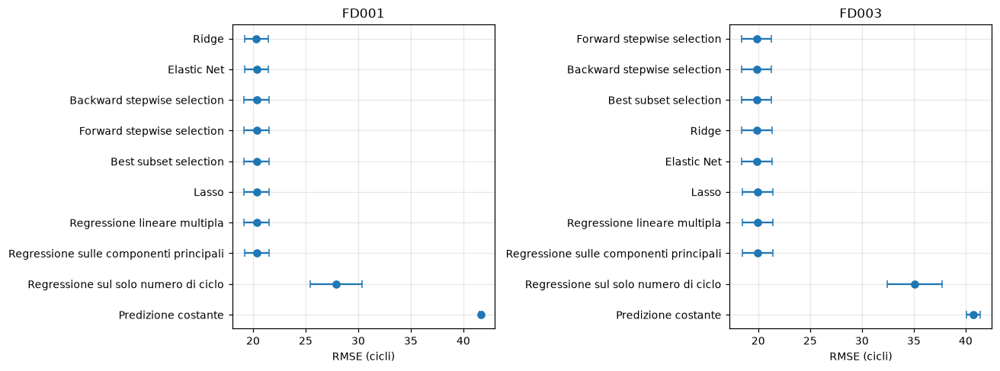

| Modello | FD001 | Configurazione | FD003 | Configurazione |
|---|---|---|---|---|
| Ridge | 20,33 ± 1,14 | alpha = 1000 | 19,88 ± 1,45 | alpha = 1778 |
| Elastic Net | 20,33 ± 1,13 | alpha = 0,0869, bil. 0,05 | 19,89 ± 1,45 | alpha = 0,1265, bil. 0,05 |
| Best subset, forward, backward | 20,34 ± 1,18 | k = 17 | 19,85 ± 1,45 | k = 15 |
| Lasso | 20,35 ± 1,18 | alpha = 0,0281 | 19,92 ± 1,46 | alpha = 0,1842 |
| Regressione lineare multipla | 20,35 ± 1,18 | nessun iperparametro | 19,93 ± 1,46 | nessun iperparametro |
| Componenti principali | 20,35 ± 1,17 | 6 componenti | 19,93 ± 1,46 | 19 componenti |

Tutti i modelli cadono entro 0,02 dispersioni su FD001 e 0,06 su FD003: sotto questo protocollo non sono distinguibili e non vengono ordinati. La sola differenza da interpretare come reale è la distanza dalle baseline.

Il pareggio ha spiegazione strutturale coerente con l'esplorazione: le righe sono tre ordini di grandezza più numerose delle variabili e la correlazione massima fra sensori è 0,963, quindi la stima dei minimi quadrati non ha varianza in eccesso da ridurre e ogni forma di contrazione può al più pareggiarla. Il limite del blocco non è la varianza della stima ma la classe di funzioni.

Due controlli di correttezza cadono in questo blocco. La regressione sulle componenti principali seleziona su FD003 il numero massimo di componenti, dove la trasformazione è una rotazione della matrice, e il modello coincide numericamente con la regressione lineare multipla (19,934353 in entrambi i casi); il bordo non produce estensione perché oltre il numero di variabili non esistono componenti, ed è quindi il limite strutturale della tecnica. Su FD001 la selezione si ferma invece a sei componenti ottenendo lo stesso errore con dodici componenti in meno.

**La ricerca esaustiva non trova nulla che le ricerche direzionali non trovino.** I tre metodi selezionano lo stesso sottoinsieme su entrambi i sottoinsiemi: su FD001 escludono `setting_1`, su FD003 escludono `cycle`, `setting_2`, `sensor_07` e `sensor_12`. La ricerca esaustiva esplora 262.143 e 524.287 sottoinsiemi e arriva dove arrivano forward e backward stepwise con diciotto e diciannove valutazioni. È un risultato negativo sul valore della ricerca esaustiva su questi dati: la struttura del problema non presenta le interazioni fra variabili che rendono subottimali le ricerche greedy.

Nella forma del laboratorio la ricerca esaustiva non sarebbe eseguibile, richiedendo mezzo milione di stime per fold. Il progetto la riformula algebricamente: i minimi quadrati su un sottoinsieme si ottengono dalle sottomatrici di X'X e X'y, che dipendono dalla partizione e non dal sottoinsieme, e l'errore sulla parte di verifica si scrive come forma quadratica nei coefficienti senza costruire le previsioni. Il costo per sottoinsieme passa dall'ordine del numero di righe a quello del quadrato del numero di variabili selezionate. La riformulazione è codice del progetto e non di libreria, quindi un errore avrebbe prodotto numeri plausibili e sbagliati: è verificata contro la valutazione ordinaria su sottoinsiemi casuali, contro una ricerca esaustiva ingenua su un pool ridotto e contro l'impossibilità che una ricerca greedy batta l'esaustiva a parità di cardinalità.

**Il costo della selezione condotta sulle stesse partizioni su cui si riporta il punteggio** è stato misurato con un controllo diagnostico che rifà la selezione dentro ciascuna delle quindici partizioni, con cross-validation interna sui soli motori di addestramento.

| Sottoinsieme | Riportato | Con selezione annidata | Ottimismo | Vantaggio sui minimi quadrati | Cardinalità nei fold |
|---|---|---|---|---|---|
| FD001 | 20,345 | 20,347 | 0,002 | 0,0002 | 15, 16, 17 |
| FD003 | 19,849 | 20,125 | 0,276 | 0,086 | 13, 14, 15, 16 |

Su FD003 la selezione guadagna 0,086 cicli sulla regressione lineare multipla mentre l'ottimismo introdotto dal modo in cui quel guadagno è misurato vale 0,276 cicli, tre volte tanto: il primo posto dei metodi di selezione nella tabella di FD003 è un effetto del protocollo e non una proprietà dei modelli. La variabilità delle cardinalità selezionate fra fold conferma che il minimo della curva è instabile perché la curva è piatta.

**Due procedure che non condividono criterio convergono sulle stesse variabili non informative.** Il bootstrap sui motori individua come coefficienti di segno non stabile `setting_1` e `setting_2` su FD001, e gli stessi due più `sensor_07` su FD003; la selezione esclude `setting_1` su FD001 e `cycle`, `setting_2`, `sensor_07`, `sensor_12` su FD003. L'indicazione convergente su `setting_1`, `setting_2` e `sensor_07` è sostenuta da evidenza indipendente e coincide con l'attesa costruita in esplorazione.

**Risposta del blocco.** Su questa matrice regolarizzazione e selezione delle variabili non hanno varianza da recuperare; il limite è la classe di funzioni.

Limiti: tutte le misure sono in cross-validation e nessuna riga dell'insieme di verifica è stata letta nel blocco; il motore di stima usato dai metodi di selezione è codice del progetto, e la sua equivalenza con la stima ordinaria è verificata ma resta un punto in cui il progetto non si appoggia a un'implementazione di riferimento; le procedure di ricampionamento operano su cento unità e le loro stime hanno la variabilità che compete a un campione di cento elementi.

### Superamento della linearità

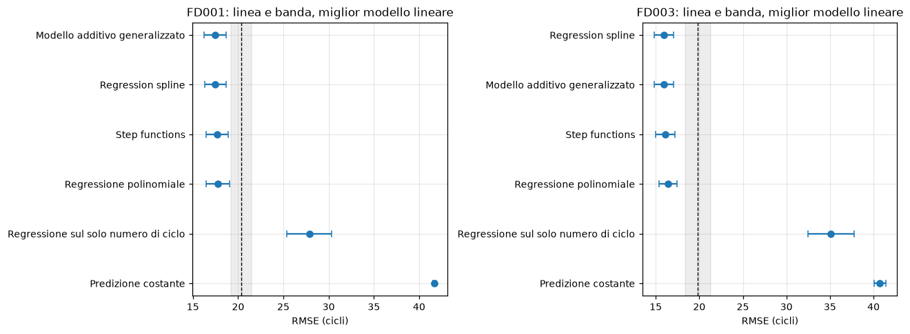

| Modello | FD001 | Configurazione | Termini | FD003 | Configurazione | Termini |
|---|---|---|---|---|---|---|
| Modello additivo generalizzato | 17,46 ± 1,21 | pen. 100, 20 funzioni di base | 18 | 15,95 ± 1,09 | pen. 10, 20 funzioni di base | 19 |
| Regression spline | 17,47 ± 1,19 | grado 2, tagli uguali, 5 nodi | 88 | 15,91 ± 1,10 | grado 1, tagli uguali, 12 nodi | 203 |
| Step functions | 17,69 ± 1,20 | 20 intervalli, tagli uguali | 324 | 16,10 ± 1,08 | 30 intervalli, quantili | 475 |
| Regressione polinomiale | 17,75 ± 1,28 | grado 2 | 189 | 16,44 ± 1,02 | grado 2 | 209 |

Le quattro tecniche sono applicate a tutte le variabili e non a una per volta come nella parte didattica del materiale, perché un modello costruito su una sola variabile non sarebbe confrontabile con quelli degli altri blocchi. Ogni modello è una pipeline in cui la trasformazione precede una regressione lineare, quindi la trasformazione è adattata dentro ciascun fold come la standardizzazione.

Il guadagno sul blocco precedente vale 2,86 cicli su FD001 e 3,93 su FD003, cioè 2,44 e 3,06 dispersioni, ed è il primo divario del progetto che superi la soglia di leggibilità fissata dal protocollo.

**Il guadagno viene dall'additività non lineare e non dalle interazioni.** I tre modelli additivi precedono la regressione polinomiale su entrambi i sottoinsiemi, e il polinomio è l'unico dei quattro che rappresenta l'effetto congiunto di due variabili.

**Il numero di termini non è correlato all'errore.** Il modello additivo usa diciotto termini e le step functions su FD003 ne usano 475, a una frazione di dispersione l'uno dall'altro. Le curve di validazione scendono rapidamente e poi restano piatte su un tratto lungo: su FD001 ventisette configurazioni di spline su trenta cadono entro un ciclo dal minimo, e trentasette su quarantacinque per il modello additivo. La configurazione selezionata cade quindi su un tratto piatto e non va commentata come un ottimo individuato con precisione.

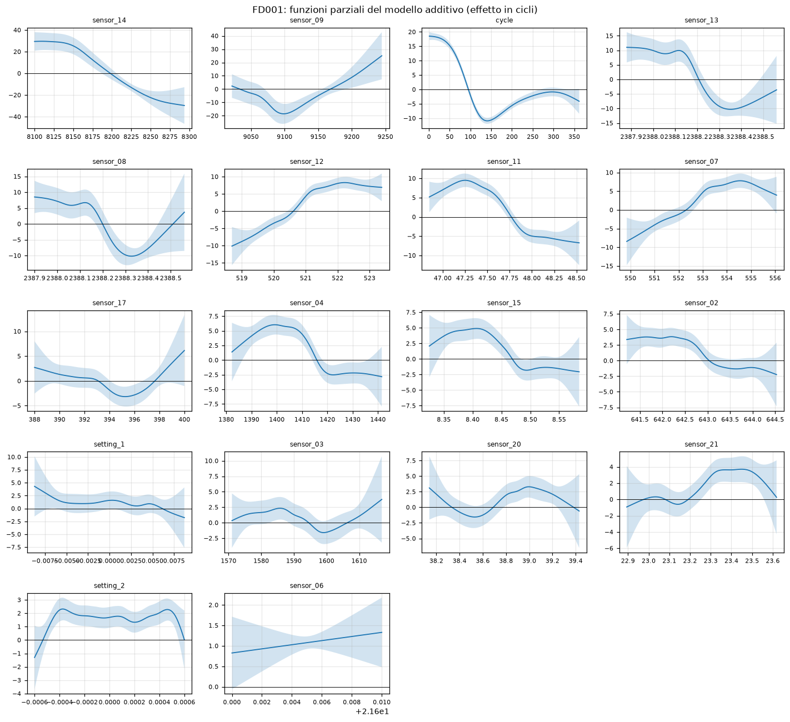

Le funzioni parziali mostrano andamenti monotoni sui sensori più informativi, con la curvatura concentrata nella regione corrispondente alla fase di degrado, e funzioni piatte sulle impostazioni operative: è la conferma per via indipendente di ciò che la selezione delle variabili aveva indicato nel blocco precedente.

Un problema tecnico incontrato nel blocco ha conseguenze sul protocollo e va dichiarato. La base spline di grado 0 con estrapolazione costante fallisce su qualunque valore fuori dall'intervallo osservato in addestramento; quando una configurazione solleva un'eccezione la ricerca su griglia le assegna punteggio non definito e prosegue, quindi la configurazione sparisce senza lasciare traccia, e il controllo sui bordi perde significato se la zona verso cui la griglia è stata estesa è proprio quella non valutata. La soluzione adottata è un contatore delle configurazioni con punteggio non definito, riportato negli artefatti e verificato con uno stimatore che fallisce di proposito. L'estensione della griglia del grado è stata ritirata perché il grado 0 produce funzioni indicatrici su intervalli uguali, cioè le step functions già presenti in tabella come modello a sé. Limite dichiarato che ne consegue: su FD003 la spline resta selezionata sul grado minimo della griglia.

**Risposta del blocco.** Rappresentare una funzione liscia per variabile recupera circa tre cicli; come la si rappresenti (base spline, discretizzazione a intervalli o penalizzazione su funzioni di base) non produce differenze leggibili.

Cautele: i primi due modelli distano 0,00 e 0,03 dispersioni e non vengono ordinati, ed è coerente che a pareggiare siano spline e modello additivo, che rappresentano la stessa cosa e differiscono per come ne governano la flessibilità; il numero di configurazioni esplorate varia da 3 a 45 fra le righe; il modello additivo è l'unico del confronto stimato da una libreria diversa da scikit-learn, attraverso un adattatore scritto per il progetto.

### Famiglia ad albero

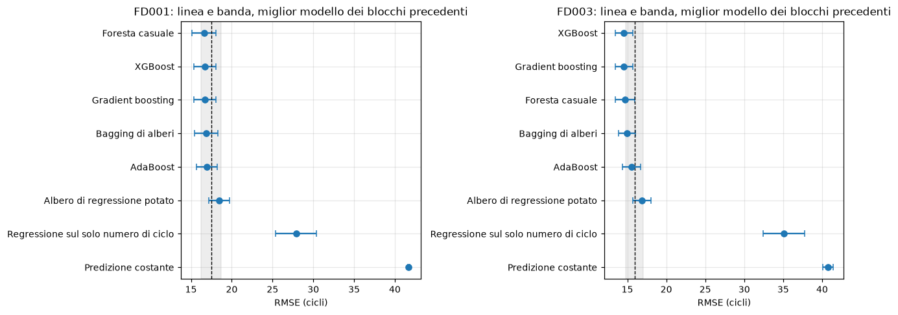

| Modello | FD001 | Configurazione | FD003 | Configurazione |
|---|---|---|---|---|
| Foresta casuale | 16,59 ± 1,46 | frazione 0,33, foglia minima 5 | 14,70 ± 1,21 | frazione 0,33, foglia minima 5 |
| XGBoost | 16,70 ± 1,36 | tasso 0,05, profondità 3, 300 stadi | 14,56 ± 1,11 | tasso 0,05, profondità 5, 300 stadi |
| Gradient boosting | 16,71 ± 1,37 | tasso 0,05, profondità 3, 300 stadi | 14,58 ± 1,14 | tasso 0,05, profondità 5, 300 stadi |
| Bagging di alberi | 16,89 ± 1,44 | nessun iperparametro | 14,94 ± 1,11 | nessun iperparametro |
| AdaBoost | 16,97 ± 1,27 | tasso 0,01, profondità 6, 800 stadi | 15,52 ± 1,18 | tasso 0,01, profondità 6, 800 stadi |
| Albero di regressione potato | 18,48 ± 1,27 | ccp_alpha 0,631, 57 foglie | 16,87 ± 1,13 | ccp_alpha 0,398, 119 foglie |

**La famiglia non produce un vincitore ma un plateau.** I cinque insiemi stanno entro 0,27 dispersioni su FD001 e 0,84 su FD003 e non sono ordinabili. L'albero singolo è l'unico modello della famiglia che se ne stacca, indietro di 1,38 e 2,07 dispersioni, il che misura direttamente quanto valga l'aggregazione rispetto al modello di base che la compone.

**Il numero di alberi non è un iperparametro.** L'errore di un insieme per aggregazione decresce in valore atteso in modo monotono e satura, quindi quel numero governa la precisione di una media e non un compromesso; in griglia verrebbe sempre selezionato il valore massimo, con richiesta di estensione senza fine. È fissato a 300, e la scelta è verificata dalla curva di saturazione misurata prima dell'esecuzione: fra 300 e 500 alberi l'errore si sposta di 0,010 cicli sul bagging di FD001 e di 0,024 sulla foresta di FD003, contro dispersioni fra fold sopra l'unità, e su FD003 non è nemmeno monotono. La stessa curva fornisce un controllo di correttezza, perché il bagging coincide con la foresta quando ogni divisione può scegliere fra tutte le variabili, e a parità di numero di alberi i due errori coincidono (16,150 contro 16,150 su FD001).

**L'effetto della decorrelazione si legge nelle importanze più che nella metrica.** La separazione fra bagging e foresta va nella direzione attesa su entrambi i sottoinsiemi ma vale 0,21 e 0,34 dispersioni, quindi è visibile nel segno e non nella misura. Nell'importanza per permutazione il peso del numero di ciclo scende invece da 12,41 a 7,87 cicli su FD001 e da 14,82 a 5,70 su FD003 passando dal bagging alla foresta: obbligando ogni divisione a scegliere fra un terzo delle variabili, la foresta costruisce percorsi ridondanti, e permutare il numero di ciclo lascia intatta l'informazione che i sensori portano al suo posto. Le due misure di importanza non coincidono e sono tenute separate: su FD001 il numero di variabili che raccolgono il novanta per cento dell'importanza da riduzione di impurità passa da 2 sull'albero potato a 9 sulla foresta.

**Le due implementazioni di gradient boosting differiscono per il tempo e non per il risultato.** Le griglie sono state rese identiche proprio per consentire questa lettura: sulle trentasei configurazioni appaiate lo scarto medio vale 0,002 e 0,007 cicli e il massimo 0,098 e 0,115, mentre il tempo di ricerca differisce di un fattore 22 su FD001 e 29 su FD003. La differenza fra le due righe è computazionale e non statistica; lo scarto residuo ha causa nota nella regolarizzazione predefinita dell'implementazione esterna, non azzerata.

**AdaBoost si ferma su un angolo della griglia per una ragione algoritmica.** In AdaBoost.R2 il peso di ciascuno stadio è il tasso di apprendimento moltiplicato per il logaritmo dell'inverso dell'errore relativo, quindi il tasso riscala tutti i pesi della stessa costante, e l'aggregazione per mediana pesata è invariante a un riscalamento comune. Il tasso agisce solo attraverso l'aggiornamento dei pesi delle osservazioni, e quando tende a zero il ripesaggio si annulla: il limite è il bagging, che il confronto contiene già con una riga propria. Il bordo inferiore del tasso è quindi strutturale e non vero, e la classificazione fissata all'inizio del blocco è stata corretta di conseguenza, indipendentemente dai punteggi ottenuti. Limite dichiarato: AdaBoost è riportato al miglior valore della griglia esplorata e non al proprio ottimo.

**La potatura per cost-complexity non può seguire la procedura del laboratorio**, che ricava la sequenza dei valori dai dati e sceglie quello che minimizza l'errore sull'insieme di verifica: la scelta guarderebbe i dati su cui si misura il risultato, e una sequenza ricavata dai dati cambia da fold a fold, quindi non definisce una griglia comune. La griglia adottata è fissata a priori e uguale ovunque, e la sua scala non è arbitraria, perché il parametro è nelle unità dell'impurità e l'impurità della radice è la varianza del target: l'intervallo copre per costruzione l'intero percorso dall'albero non potato all'albero ridotto alla radice.

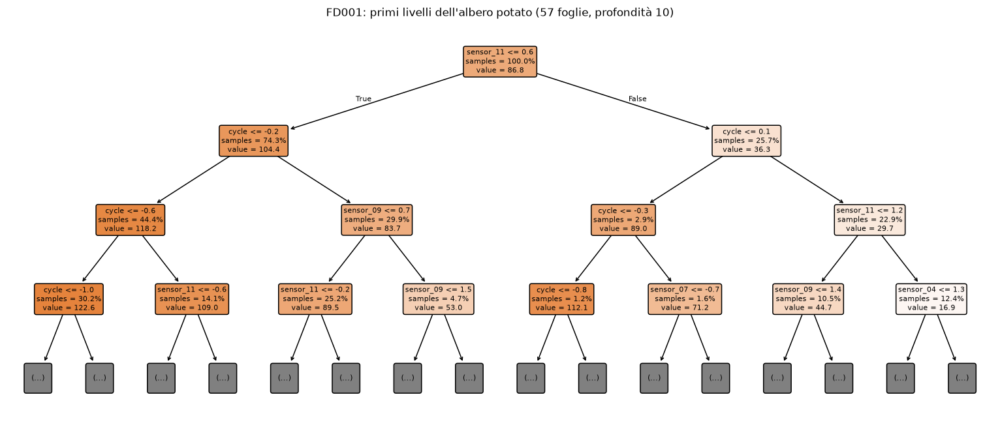

L'albero potato è l'unico modello del confronto la cui logica si legge per intero. La prima divisione avviene su `sensor_11` a 47,70 su FD001 e a 47,60 su FD003, cioè quasi allo stesso valore fisico su due popolazioni diverse. Le soglie sono riportate anche nelle unità originali invertendo lo standardizzatore adattato, perché la standardizzazione è dentro la pipeline di tutti i modelli per parità di condizioni.

**Risposta del blocco.** L'aggregazione vale fra 1,4 e 2,1 dispersioni rispetto all'albero singolo, ma quale forma di aggregazione si adotti non produce differenze leggibili. Il confronto con i blocchi precedenti è asimmetrico: su FD003 il miglior modello ad albero sta a 1,2 dispersioni dalle spline ed è un vantaggio leggibile, su FD001 la distanza è 0,6 dispersioni e cade sotto la risoluzione del protocollo.

Limite dichiarato: il numero di configurazioni esplorate varia da 1 a 100 fra le righe della stessa tabella, e il bagging, privo di griglia, non paga alcuna distorsione da selezione mentre AdaBoost ne paga quanta ne producono cento configurazioni.

### Metodi a margine e reti

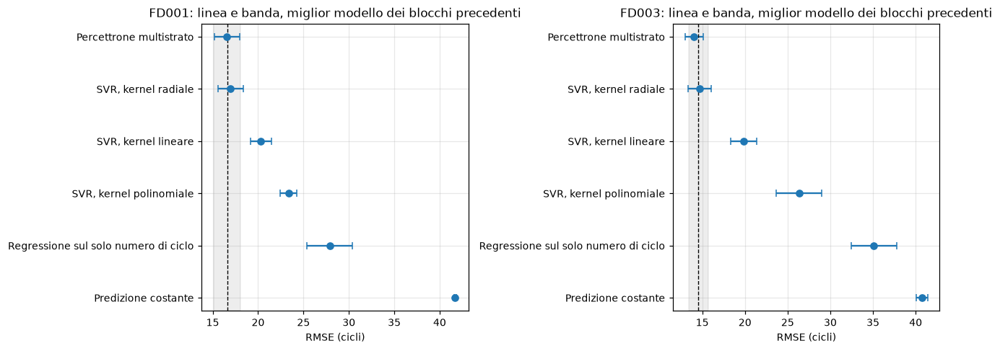

| Modello | FD001 | Configurazione | FD003 | Configurazione |
|---|---|---|---|---|
| Percettrone multistrato | 16,58 ± 1,40 | 16 unità, passo 1e-3, 1000 iter. | 14,04 ± 1,06 | 128 e 64 unità, passo 1e-4, 250 iter. |
| SVR, kernel radiale | 16,96 ± 1,41 | C = 100, banda 8, ampiezza 0,015 | 14,68 ± 1,37 | C = 10, banda 4, ampiezza 0,05 |
| SVR, kernel lineare | 20,32 ± 1,12 | C = 0,01, banda 16 | 19,83 ± 1,52 | C = 0,01, banda 8 |
| SVR, kernel polinomiale | 23,35 ± 0,93 | C = 10, banda 16, ampiezza 0,06 | 26,34 ± 2,67 | C = 0,1, banda 16, ampiezza 0,06 |

Il costo della stima a margine con kernel cresce fra il quadrato e il cubo del numero di righe, e le righe di addestramento per fold sono 16.435 su FD001 e 19.303 su FD003, quindi il blocco poteva risultare impraticabile sotto il protocollo pieno. Le griglie sono state fissate dopo una misura: l'esponente empirico vale fra 1,83 e 2,06 sui sei casi, la crescita è quadratica e non cubica, e il blocco gira sulla matrice intera senza sottocampionamenti e senza trattamenti differenziati. Erano state predisposte e sono state scartate tre alternative, tutte previste per il caso di costo proibitivo: diradare le righe dentro il fold, che avrebbe reso questa famiglia l'unica valutata su una matrice ridotta; stimare il solo kernel lineare in forma primale, assente dal materiale del laboratorio; e ridurre il protocollo per la sola famiglia a margine, scartata a priori perché avrebbe rotto la parità del protocollo di valutazione.

**La griglia del laboratorio sulla banda di insensibilità non è trasferibile.** Il laboratorio usa 0,1 su un target con deviazione standard circa 1,15, cioè circa il nove per cento della dispersione; qui il target è in cicli con deviazione standard circa 41, e lo stesso rapporto vale circa quattro cicli. Trascrivere il valore alla lettera avrebbe reso vettore di supporto quasi ogni riga, con effetto simultaneo sulla specificazione e sul costo della stima.

**Il kernel polinomiale è mal condizionato su questi dati, e la sua riga è un limite superiore e non una misura della tecnica.** Il valore del kernel è il prodotto interno fra due righe moltiplicato per l'ampiezza ed elevato al grado; con diciotto colonne standardizzate il prodotto interno è dell'ordine delle diciotto unità, quindi oltre l'inverso del numero di colonne la matrice del kernel assume valori di ampiezza crescente e il problema diventa mal condizionato. Non si tratta di mancata convergenza ma di convergenza lentissima verso una soluzione inaffidabile: ad ampiezza 0,15 l'errore vale 110,1 cicli su FD001 e 18,5 su FD003, cioè un fattore sei fra due sottoinsiemi che tutti gli altri modelli trattano quasi allo stesso modo. L'estremo superiore dell'ampiezza è quindi fissato all'inverso del numero di colonne e dichiarato bordo strutturale prima dell'esecuzione; il kernel radiale non ha questo problema perché il suo valore resta fra zero e uno, e l'asimmetria fra le due griglie è motivata dalla matematica del kernel e non dal tempo di calcolo. Il grado è fissato a 3 e non selezionato, perché sull'angolo peggiore il grado 4 produce stime troncate.

**L'arresto anticipato della rete resta disattivato per una ragione di protocollo.** La partizione interna che la libreria costruirebbe è ottenuta mescolando le righe, quindi collocherebbe cicli adiacenti dello stesso motore da entrambe le parti, reintroducendo dentro il modello la contaminazione che il vincolo di gruppo esclude fuori. Il numero massimo di iterazioni entra invece in griglia, a differenza del numero di alberi del blocco precedente, perché la curva misurata prima dell'esecuzione mostra che le due quantità non si comportano allo stesso modo: sull'architettura a due strati con passo 1e-3 la perdita di addestramento scende da 114,0 a 74,0 fra 100 e 3.000 iterazioni mentre l'errore sulla parte di verifica sale da 15,86 a 18,87 cicli. Le iterazioni non fanno saturare l'errore, lo fanno risalire, quindi governano un compromesso e vanno selezionate.

**Tre famiglie costruite su principi diversi convergono sullo stesso livello.** La rete e il kernel radiale raggiungono il livello del miglior modello dei blocchi precedenti senza superarlo in modo leggibile, con divari di 0,01 e 0,52 cicli contro dispersioni sopra l'unità. È l'argomento più forte a sostegno della lettura per gradini: il limite osservato dipende dal problema e dalla rappresentazione dei dati più che dalla classe di modelli.

**Il kernel lineare arriva dove arrivano i modelli lineari**, con 20,32 contro i 20,33 di Ridge su FD001 e 19,83 contro 19,85 dei metodi di selezione su FD003. Due stimatori diversi della stessa classe di funzioni, sotto perdite diverse, producono lo stesso numero a due decimali: è una verifica indipendente che catena dati e protocollo non introducono differenze spurie fra blocchi eseguiti in momenti diversi.

**L'asimmetria fra i due sottoinsiemi riguarda qui la capacità richiesta e non solo il livello di errore.** La rete migliore su FD001 è la più stretta della griglia, con sedici unità e 321 parametri; quella su FD003 è la più larga, con due strati da 128 e 64 unità e 10.881 parametri, e i profili lungo lo stesso asse hanno segno opposto. Due modi di guasto invece di uno richiedono una funzione più articolata.

Un comportamento che la metrica non registra: la frazione di vettori di supporto dei modelli selezionati sta fra il 44,5 e il 64,5 per cento, quindi la previsione richiede il calcolo del kernel contro decine di migliaia di righe, e questi sono i modelli più lenti in previsione dell'intero confronto, mentre alberi e rete rispondono in tempo costante rispetto alla dimensione dell'insieme di addestramento.

**Risposta del blocco.** La scelta del kernel conta più della scelta della famiglia: la stessa tecnica occupa il primo e l'ultimo posto della graduatoria complessiva a seconda di come misura la somiglianza fra due motori.

Limite dichiarato: la rete è stimata con un solo seme di inizializzazione dei pesi, quindi la dispersione riportata sui quindici fold contiene la variabilità dovuta alla partizione ma non quella dovuta all'inizializzazione, che per questa classe di modelli non è trascurabile.

## Controlli sul risultato

Le sei letture di questa sezione non riordinano la graduatoria, e tutte potevano smentirla.

### Confronto appaiato fold per fold

Le quindici partizioni sono le stesse per tutti i modelli e per tutti i blocchi, quindi la differenza fra due modelli si può calcolare fold per fold. La difficoltà del fold, che è la componente dominante della dispersione riportata in tabella, è comune ai due modelli e si elide nella differenza; l'informazione aggiuntiva sta nella dispersione della differenza e nella concordanza del segno.

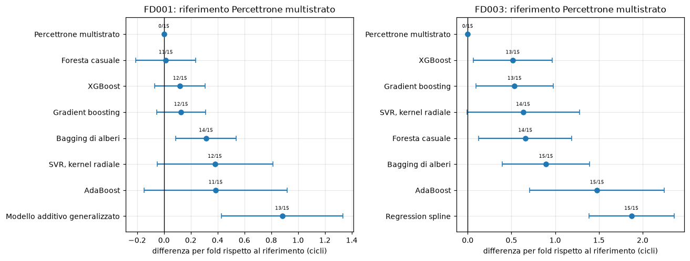

Su FD001 il divario fra rete e foresta casuale vale 0,014 ± 0,223 cicli, con la rete peggiore in undici fold su quindici: il segno non è stabile e il primo posto è un pareggio pieno. Su FD003 il divario fra rete e XGBoost vale 0,515 ± 0,451 con lo stesso segno in tredici fold su quindici, e la dispersione della differenza è meno della metà di quella dei singoli punteggi. La formulazione corretta è che il divario resta sotto la soglia di leggibilità fissata dal protocollo ma non è distribuito a caso fra i fold; le due affermazioni convivono e vanno riportate entrambe.

La lettura è fuori dal materiale del corso ed è descrittiva: non produce statistiche test, e il rapporto fra media e dispersione della differenza non è convertibile in un livello di significatività perché i quindici fold condividono le righe di addestramento.

### Variabilità dovuta al seme dello stimatore

Il protocollo fissa un solo seme di stimatore per modello, uguale per tutti, quindi la dispersione riportata in graduatoria non contiene la variabilità dovuta al seme. Con un modello stocastico in testa e altri modelli stocastici entro la soglia di leggibilità, quella variabilità va misurata, altrimenti non è possibile distinguere un primo posto che è proprietà del modello da uno che è proprietà dell'estrazione. La configurazione selezionata dei tre modelli interessati è stata rivalutata sulle stesse quindici partizioni con cinque semi; il primo è quello del protocollo e riproduce il punteggio in graduatoria con scarto nullo su tutte e sei le righe. Il risultato è diagnostico e non entra in graduatoria, perché cambiare la regola sui semi per i soli modelli stocastici romperebbe la parità del protocollo.

| Sottoinsieme | Modello | Seme del protocollo | Media fra semi | Dispersione fra semi | Escursione | Divario fra i primi due |
|---|---|---|---|---|---|---|
| FD001 | Percettrone multistrato | 16,581 | 16,654 | 0,044 | 0,110 | 0,014 |
| FD001 | Foresta casuale | 16,595 | 16,599 | 0,002 | 0,006 | 0,014 |
| FD001 | XGBoost | 16,701 | 16,701 | 0,000 | 0,000 | 0,014 |
| FD003 | Percettrone multistrato | 14,042 | 14,038 | 0,026 | 0,062 | 0,515 |
| FD003 | XGBoost | 14,558 | 14,558 | 0,000 | 0,000 | 0,515 |
| FD003 | Foresta casuale | 14,701 | 14,706 | 0,003 | 0,010 | 0,515 |

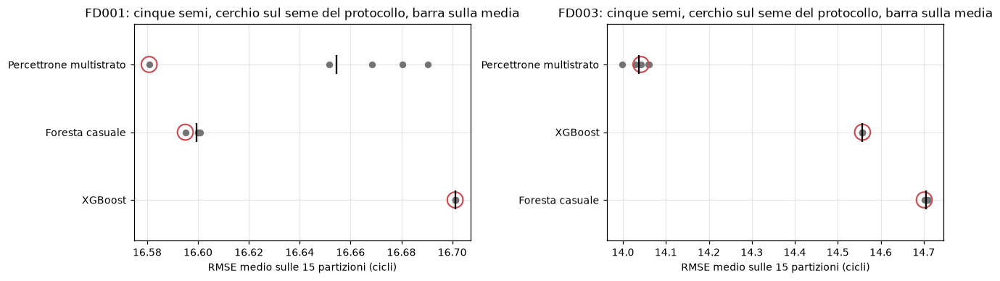

I due sottoinsiemi danno esiti opposti. Su FD001 il divario fra rete e foresta sta a un terzo del rumore di inizializzazione della rete, il seme del protocollo produce il migliore dei cinque valori, e sulla media fra semi l'ordine si inverte (16,654 contro 16,599). Il seme è fissato dal protocollo per tutti i modelli e non è stato scelto guardando i risultati, quindi la graduatoria non è viziata, ma la conclusione difendibile è che rete e foresta non siano ordinabili. Su FD003 il divario vale venti volte la dispersione fra semi e il seme del protocollo produce il valore mediano dei cinque: il primo posto regge.

La foresta casuale ha dispersione fra semi di uno o due ordini di grandezza inferiore a quella della rete, perché la media su trecento alberi assorbe la variabilità del campionamento mentre la rete ha una sola stima. XGBoost ha dispersione esattamente nulla, e questo non è stabilità: la configurazione lascia il campionamento di righe e colonne ai valori predefiniti, che valgono uno, quindi non esiste sorgente di casualità e il seme è inerte. Quella riga misura l'assenza di variabilità da misurare ed è un limite del diagnostico, non un suo risultato.

### Insieme di verifica ufficiale

I ventidue modelli selezionati e le due baseline sono stati riaddestrati sull'intera parte di addestramento e valutati una sola volta sull'insieme di verifica, secondo una regola fissata prima che esistesse il codice che quell'insieme legge: la graduatoria resta quella in cross-validation e la verifica misura il trasferimento senza riordinarla, perché ha un solo punteggio per modello e ordinare su di esso significherebbe ordinare su un numero di cui non si conosce l'incertezza. Sono letti tutti i modelli e non i soli migliori, così che il confronto fuori campione riguardi l'intera tabella.

Un controllo di fedeltà precede la lettura dei risultati e blocca l'esecuzione in caso di scostamento: le due baseline e la regressione lineare multipla erano già state lette in fase di convalida, sono deterministiche e senza iperparametri, e i loro punteggi si riproducono con scarto massimo di 0,005 cicli su dodici valori, che è l'arrotondamento con cui erano stati registrati.

| Modello | FD001 CV | FD001 tutti | FD001 ultimo | FD003 CV | FD003 tutti | FD003 ultimo |
|---|---|---|---|---|---|---|
| Percettrone multistrato | 16,58 | 15,52 | 16,72 | 14,04 | 12,65 | 16,01 |
| Foresta casuale | 16,59 | 15,64 | 16,81 | 14,70 | 13,17 | 17,36 |
| XGBoost | 16,70 | 15,66 | 16,58 | 14,56 | 12,92 | 16,26 |
| Gradient boosting | 16,71 | 15,65 | 16,52 | 14,58 | 12,90 | 16,11 |
| Bagging di alberi | 16,89 | 15,87 | 16,95 | 14,94 | 13,41 | 17,23 |
| SVR, kernel radiale | 16,96 | 15,71 | 17,12 | 14,68 | 12,78 | 17,06 |
| AdaBoost | 16,97 | 16,55 | 17,18 | 15,52 | 14,38 | 17,71 |
| Modello additivo generalizzato | 17,46 | 16,41 | 17,15 | 15,95 | 14,54 | 17,56 |
| Regression spline | 17,47 | 16,51 | 17,51 | 15,91 | 14,57 | 17,61 |
| Step functions | 17,69 | 16,56 | 17,23 | 16,10 | 14,66 | 17,90 |
| Regressione polinomiale | 17,75 | 17,46 | 18,48 | 16,44 | 14,24 | 17,74 |
| Albero di regressione potato | 18,48 | 16,97 | 18,67 | 16,87 | 14,33 | 18,06 |
| SVR, kernel lineare | 20,32 | 19,19 | 21,24 | 19,83 | 18,38 | 21,86 |
| Ridge | 20,33 | 19,11 | 21,35 | 19,88 | 18,06 | 21,66 |
| Elastic Net | 20,33 | 19,15 | 21,31 | 19,89 | 18,12 | 21,78 |
| Best subset, forward, backward | 20,34 | 19,07 | 21,43 | 19,85 | 17,97 | 21,27 |
| Lasso | 20,35 | 19,07 | 21,45 | 19,92 | 18,00 | 21,55 |
| Regressione lineare multipla | 20,35 | 19,07 | 21,45 | 19,93 | 17,96 | 21,44 |
| Componenti principali | 20,35 | 19,13 | 21,48 | 19,93 | 17,96 | 21,44 |
| SVR, kernel polinomiale | 23,35 | 20,26 | 23,27 | 26,34 | 19,38 | 28,81 |
| *Baseline sul solo numero di ciclo* | 27,88 | 23,69 | 32,25 | 35,12 | 26,03 | 36,80 |
| *Predizione costante* | 41,69 | 35,34 | 41,94 | 40,73 | 31,37 | 43,70 |

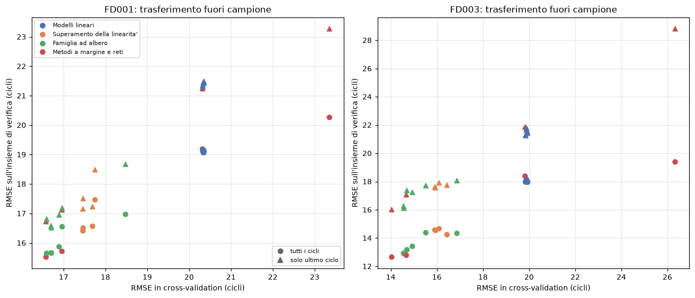

**Le quattro colonne riguardano popolazioni di cicli diverse e non si sottraggono fra loro.** L'errore sulla verifica è più basso di quello in cross-validation su ogni riga, e non è un trasferimento migliore ma un effetto della composizione della popolazione: le traiettorie di verifica sono troncate in un punto casuale e contengono in proporzione molte più righe della fase iniziale di vita, dove il target è appiattito sulla soglia, e la deviazione standard del target scende da 41,67 a 27,58 su FD001 e da 40,63 a 24,84 su FD003. Il coefficiente di determinazione si muove nella direzione opposta e attesa, scendendo da 0,761 a 0,522 su FD001. Ciò che si confronta legittimamente è la graduatoria dentro ciascuna lettura.

**L'ordine che il protocollo dichiara leggibile si trasferisce integralmente.** La correlazione di rango fra graduatoria e letture della verifica vale fra 0,87 e 0,98, ma presa da sola è fuorviante perché impone un ordine anche fra righe dichiarate non ordinabili. La misura corretta è il conteggio delle inversioni fra le sole coppie che la regola di lettura separa, cioè quelle il cui divario supera la dispersione combinata.

| Sottoinsieme | Lettura | Coppie separabili su 231 | Inversioni | Correlazione di rango |
|---|---|---|---|---|
| FD001 | tutti i cicli | 136 | 0 | 0,888 |
| FD001 | solo ultimo ciclo | 136 | 0 | 0,984 |
| FD001 | ultimo ciclo, target non censurato | 136 | 0 | 0,981 |
| FD003 | tutti i cicli | 158 | 1 | 0,869 |
| FD003 | solo ultimo ciclo | 158 | 0 | 0,930 |
| FD003 | ultimo ciclo, target non censurato | 158 | 1 | 0,914 |

Le due inversioni valgono 0,05 e 0,01 cicli e riguardano righe che la regola tratta come indistinguibili: la correlazione di rango inferiore all'unità è prodotta interamente da riordinamenti interni a gruppi già dichiarati non ordinabili.

**Il vertice si comporta come i due controlli precedenti avevano indicato.** Su FD001 il primo posto cambia titolare a seconda della lettura, con quattro modelli entro 0,3 cicli, e il risultato coincide con quello del diagnostico sul seme: due misure indipendenti portano alla stessa conclusione, cioè che su FD001 il primo posto non è assegnabile. Su FD003 la rete è prima in tutte e tre le letture, come in cross-validation e come il diagnostico sul seme aveva mostrato non attribuibile all'inizializzazione.

Il trasferimento fa emergere due comportamenti che la cross-validation non mostrava. Il kernel lineare è il migliore del gradino lineare in cross-validation su entrambi i sottoinsiemi ed è il peggiore del gradino in tutte e sei le letture della verifica: il segno è costante su sei misure e non è casuale, anche se le ampiezze restano sotto la soglia di leggibilità. La configurazione selezionata ha penalizzazione minima e banda di insensibilità ampia, cioè non penalizza gli errori sotto quella soglia, e l'insieme di verifica ha una quota di righe al valore di censura molto più alta di quella dell'addestramento; un legame fra le due cose è plausibile ma non è stato misurato e resta un'ipotesi. Su FD003, e solo nella lettura estesa, regressione polinomiale e albero potato guadagnano quattro posizioni ciascuno; l'effetto scompare sull'ultimo ciclo, quindi riguarda la parte iniziale delle traiettorie e non la fase di degrado.

Cautela: ogni lettura della verifica è un valore singolo, privo di misura di variabilità, e il conteggio delle inversioni è descrittivo e fuori dal materiale del corso.

### Distribuzione dell'errore lungo la vita del motore

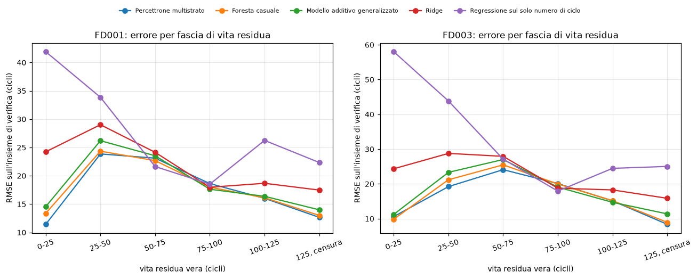

Il profilo non è monotono: l'errore è minimo ai due estremi e ha un massimo nella fascia intermedia. Sulla rete di FD003 vale 8,4 cicli nella fascia censurata, sale a 24,1 fra 50 e 75 cicli di vita residua e ridiscende a 10,6 sotto i 25. Nella fascia censurata il target è costante per costruzione e al modello basta produrre il valore di soglia, e quella fascia contiene la maggior parte delle righe di verifica: la metrica complessiva è quindi pesata verso la parte più facile del problema. Vicino al guasto l'errore torna basso, ed è la fascia operativamente rilevante; il massimo cade dove il modello deve collocare l'inizio del degrado.

La baseline sul solo numero di ciclo ha il profilo opposto, con errore massimo nella fascia più vicina al guasto (41,9 cicli su FD001, 58,0 su FD003), perché una funzione monotona del conteggio non distingue un motore che si guasta presto da uno che si guasta tardi. La distanza fra i modelli e quella baseline è quindi massima dove il conteggio fallisce: l'informazione che le letture dei sensori aggiungono non è distribuita lungo la vita del motore, è concentrata dove il conteggio non basta.

La scomposizione è descrittiva e non entra in graduatoria, perché le fasce sono definite sul target vero e non sono note al momento della previsione.

### Sensibilità alla soglia di censura

Il controllo misura se dalla soglia dipenda anche l'ordine fra le famiglie, rivalutando un modello per famiglia sulle stesse quindici partizioni con la censura disattivata. Le configurazioni restano quelle selezionate sotto censura e la ricerca non viene rifatta, perché rifarla equivarrebbe a condurre un secondo confronto completo su una diversa definizione del target. Il regime censurato ripete una misura già in graduatoria e la riproduce con scarto nullo su tutte e dodici le righe, quindi la differenza fra i due regimi è attribuibile alla sola definizione del target.

| Sottoinsieme | Modello | Censurato | Non censurato |
|---|---|---|---|
| FD001 | Percettrone multistrato | 16,58 ± 1,40 | 37,14 ± 5,68 |
| FD001 | Foresta casuale | 16,59 ± 1,46 | 37,20 ± 6,21 |
| FD001 | Modello additivo generalizzato | 17,46 ± 1,21 | 37,18 ± 5,84 |
| FD001 | Ridge | 20,33 ± 1,14 | 40,80 ± 5,52 |
| FD003 | Percettrone multistrato | 14,04 ± 1,06 | 56,56 ± 10,26 |
| FD003 | Foresta casuale | 14,70 ± 1,21 | 58,08 ± 10,48 |
| FD003 | Modello additivo generalizzato | 15,95 ± 1,09 | 60,04 ± 12,14 |
| FD003 | Ridge | 19,88 ± 1,45 | 62,03 ± 11,46 |

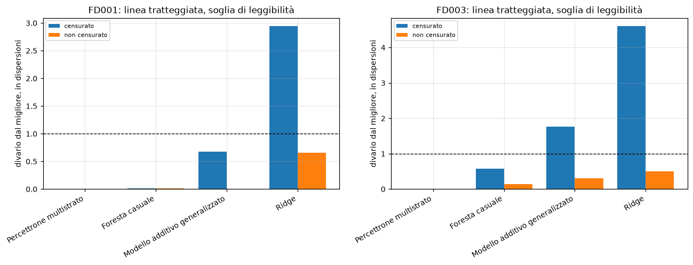

L'ordine regge. Su FD003 le quattro righe sono nello stesso ordine nei due regimi; su FD001 foresta casuale e modello additivo si scambiano, ma nel regime censurato sono due righe che il protocollo già non ordina, quindi lo scambio non inverte un ordine leggibile. Ridge resta ultima fra i modelli in entrambi i regimi e su entrambi i sottoinsiemi, quindi la separazione fra il gradino lineare e gli altri non dipende dalla soglia.

Il risultato più informativo non riguarda l'ordine ma la dispersione. Togliendo la censura, la dispersione fra fold passa da 1,1-1,5 a 5,5-6,2 cicli su FD001 e da 1,0-1,4 a 10,3-12,1 su FD003, mentre il divario fra Ridge e la rete resta quasi invariato in cicli (3,75 contro 3,66 su FD001). Misurato nell'unità del protocollo, quel divario passa da 2,94 a 0,65 dispersioni su FD001 e da 4,61 a 0,50 su FD003, e nel regime non censurato la regola di lettura non separa più alcuna coppia fra i quattro modelli. **La censura non sposta i modelli: cambia la risoluzione con cui il confronto li distingue.** È un argomento a favore della soglia indipendente da quello con cui era stata fissata, e non è circolare, perché abbassare la soglia riduce l'errore per costruzione ma nulla impone che aumenti anche il rapporto fra i divari e la dispersione fra fold.

Limiti: il controllo riguarda quattro modelli su ventidue e una sola soglia alternativa, che è l'assenza di soglia; le configurazioni sono congelate, quindi il regime non censurato è valutato con iperparametri scelti per un target di scala diversa, e una famiglia il cui ottimo si sposta molto risulta svantaggiata; nel regime non censurato l'affermazione difendibile riguarda la concordanza dell'ordine e non la leggibilità dei divari.

### Struttura delle due popolazioni

I metodi non supervisionati del programma sono usati per stabilire se la differenza fra i due sottoinsiemi sia visibile nella forma delle traiettorie osservate senza il target. Il risultato è strumento di commento e non una riga del confronto, perché il task del progetto è di regressione. L'unità di osservazione è il motore: ciascuno è descritto dalla lettura media negli ultimi dieci cicli e dalla deriva totale di ogni sensore non costante, più la durata della traiettoria, per 31 variabili su FD001 e 33 su FD003. Le etichette di modo di guasto dei singoli motori non sono distribuite con il dataset, quindi non esiste un riferimento contro cui misurare la correttezza di un raggruppamento, e il numero di gruppi si legge sulla silhouette.

| Gruppi | FD001 K-Means | FD001 Ward | FD003 K-Means | FD003 Ward |
|---|---|---|---|---|
| 2 | 0,260 | 0,240 | 0,533 | 0,533 |
| 3 | 0,241 | 0,198 | 0,479 | 0,477 |
| 4 | 0,232 | 0,206 | 0,483 | 0,482 |
| 5 | 0,203 | 0,204 | 0,406 | 0,397 |
| 6 | 0,169 | 0,155 | 0,249 | 0,222 |

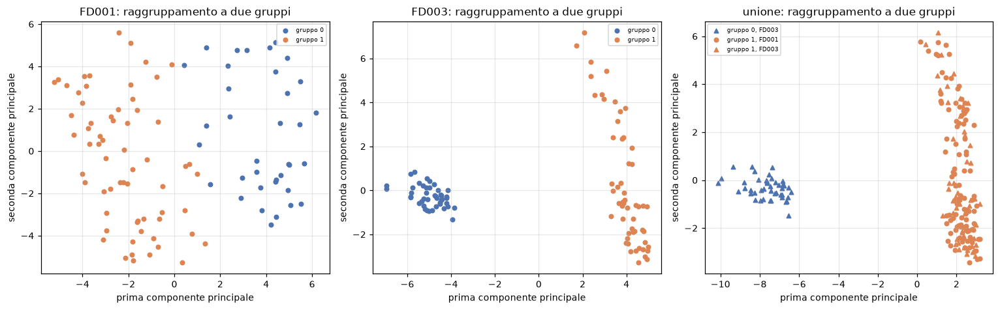

Su FD001 non emerge struttura di gruppi: la silhouette massima vale 0,260 e decresce da lì, e i due algoritmi allo stesso numero di gruppi concordano solo per 0,702, cioè trovano partizioni diverse. Su FD003 la struttura c'è ed è a due gruppi: la silhouette vale 0,533 con un massimo interno, K-Means e Ward producono la stessa identica partizione, le dimensioni sono 44 e 56, e la partizione è invariante su tutti e cinque i semi di inizializzazione. Il numero di gruppi coincide con il numero di modi di guasto documentato per FD003, ma senza etichette per unità che i due gruppi siano i due modi resta interpretazione: ciò che è misurato è che FD003 si separa e FD001 no.

Raggruppando insieme i duecento motori dei due sottoinsiemi, dove l'appartenenza al sottoinsieme è un'etichetta esterna vera, la partizione a due gruppi ottiene silhouette 0,552 ma accordo di sole 0,191 con quell'etichetta, e produce gruppi di 44 e 156 unità. I 44 sono esattamente i 44 che FD003 separa da solo, e i cento motori di FD001 finiscono tutti nel gruppo maggiore insieme ai restanti 56 di FD003.

| Insieme | Motori | Durata media | Dispersione |
|---|---|---|---|
| FD001 | 100 | 206,3 | 46,3 |
| FD003, gruppo che si sovrappone a FD001 | 56 | 202,1 | 42,3 |
| FD003, gruppo separato | 44 | 304,7 | 94,3 |

**FD003 è composto da una popolazione indistinguibile da FD001 più una seconda popolazione separata.** Ricomponendo i due gruppi si ottiene la dispersione complessiva di 86,5 cicli misurata in esplorazione: la dispersione anomala delle durate di FD003, che era un fatto isolato, è interamente prodotta dalla convivenza di due popolazioni. Poiché la durata è una delle variabili del raggruppamento, la separazione è stata verificata escludendola: su FD003 la partizione coincide con quella completa e la silhouette sale da 0,533 a 0,542, quindi la separazione è prodotta dalle sole letture dei sensori e la differenza di durata ne è una conseguenza.

Limiti: le variabili per motore riassumono la traiettoria con lo stato di fine vita e la deriva complessiva, quindi una traiettoria che degrada in modo non monotono e una che degrada linearmente fino allo stesso punto sono indistinguibili in questa rappresentazione; una silhouette di 0,533 indica separazione leggibile ma non netta; il raggruppamento descrive la struttura della popolazione e non spiega perché i modelli ottengano su FD003 punteggi migliori.

## Conclusioni

**Sul miglior modello.** Su FD003 il percettrone multistrato è il modello migliore: primo in cross-validation e in tutte e tre le letture dell'insieme di verifica indipendente, con un vantaggio su XGBoost venti volte maggiore della variabilità dovuta al seme di inizializzazione. Il divario resta comunque sotto la soglia di leggibilità fissata dal protocollo, quindi l'affermazione difendibile è che la rete sia la scelta migliore disponibile e non che sia distinguibile dai modelli che la seguono. Su FD001 il primo posto non è assegnabile: il confronto appaiato fold per fold, la variabilità fra semi dello stimatore e il trasferimento fuori campione concordano nell'attribuire il vantaggio della rete all'estrazione e non al modello, e quattro modelli stanno entro 0,3 cicli.

**Sul risultato che regge senza riserve.** È la struttura per famiglie. Una classe di funzioni lineari nelle letture al ciclo corrente si ferma attorno ai venti cicli di errore, e nessuna forma di regolarizzazione o di selezione delle variabili la migliora, perché su questa matrice non c'è varianza in eccesso da ridurre. Rappresentare una funzione liscia per variabile recupera circa tre cicli, e come la si rappresenti non fa differenza. Insiemi di alberi, kernel radiale e rete raggiungono lo stesso livello per vie costruttive diverse e non si distinguono fra loro, il che indica che il limite residuo dipende dal problema e dalla rappresentazione dei dati più che dalla classe di modelli. L'ordine dei tre gradini si replica identico sulle due popolazioni e in tutte le letture; la risoluzione con cui il protocollo li separa cambia da un sottoinsieme all'altro.

**Limiti del lavoro.** I limiti locali sono dichiarati accanto al risultato che li produce; ne restano cinque trasversali.

La cross-validation non è annidata, quindi ogni punteggio riportato è ottimisticamente distorto, e la distorsione non è uniforme fra le righe perché il numero di configurazioni valutate sulle stesse partizioni su cui il punteggio è poi riportato varia da 1 a 524.287. L'entità è stata quantificata per il caso più esposto ed è risultata di 0,002 cicli su FD001 e 0,276 su FD003, cioè trascurabile sul primo e superiore al vantaggio del metodo sul secondo.

La dispersione riportata non è un errore standard, perché i quindici fold condividono le righe di addestramento: tutte le affermazioni sull'ordinabilità di due modelli riguardano la risoluzione del protocollo e non una significatività statistica.

La rappresentazione a letture grezze non sfrutta la struttura temporale delle traiettorie, e i valori assoluti restano perciò distanti da quelli ottenibili con variabili aggregate su finestra. È una scelta di perimetro, e va tenuta presente confrontando questi numeri con la letteratura.

Il perimetro è a regime operativo singolo, e le conclusioni non sono state verificate sui due sottoinsiemi a sei condizioni operative.

La soglia di censura è un'ipotesi di modellazione e non una quantità misurata, e su FD003 scarta una parte di segnale presente già prima della soglia.

## Tecniche fuori dal programma del corso

Sono quattro, segnalate come tali anche nel punto in cui compaiono. La **cross-validation con vincolo di gruppo** è la trasposizione diretta del K-Fold a dati raggruppati, resa obbligatoria dalla struttura del dataset. **XGBoost** è un'implementazione alternativa di gradient boosting, trattata come riga distinta con griglia identica a quella di scikit-learn proprio per rendere misurabile la differenza fra implementazioni. Il **confronto appaiato fold per fold** e il **conteggio delle inversioni fra coppie separabili** sono letture descrittive introdotte per esaminare il vertice della graduatoria e la concordanza fra cross-validation e verifica; nessuna delle due produce statistiche test, e nessuna sostituisce la regola di lettura del protocollo.

Non sono state impiegate tecniche di combinazione di modelli eterogenei, né modelli che trattano esplicitamente la struttura sequenziale delle traiettorie, né la funzione di punteggio asimmetrica adottata in letteratura su C-MAPSS.

## Crediti e riferimenti

Il dataset **C-MAPSS Turbofan Engine Degradation Simulation** è distribuito dal NASA Prognostics Center of Excellence attraverso il NASA Prognostics Data Repository, all'indirizzo `https://phm-datasets.s3.amazonaws.com/NASA/6.+Turbofan+Engine+Degradation+Simulation+Data+Set.zip`. Riferimento: A. Saxena, K. Goebel, D. Simon, N. Eklund, "Damage Propagation Modeling for Aircraft Engine Run-to-Failure Simulation", International Conference on Prognostics and Health Management, 2008. I file grezzi e la documentazione originale non sono ridistribuiti in questa repository.

Le implementazioni dei modelli provengono da librerie di terzi, utilizzate senza modificarne il funzionamento interno: **scikit-learn** per la maggior parte dei modelli, del pre-processing e delle procedure di ricerca; **XGBoost** per l'implementazione alternativa di gradient boosting; **pygam** per il modello additivo generalizzato, attraverso un adattatore scritto per il progetto perché la classe non espone l'interfaccia richiesta da scikit-learn agli stimatori usati in composizione. Il calcolo numerico si appoggia a **NumPy**, **SciPy**, **pandas** e **statsmodels**, la produzione delle figure a **Matplotlib** e **seaborn**. Le versioni esatte sono in `requirements.txt`.
